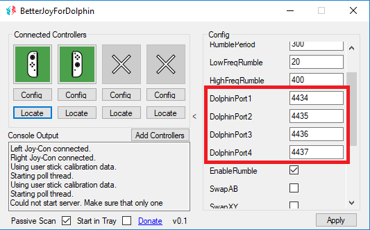
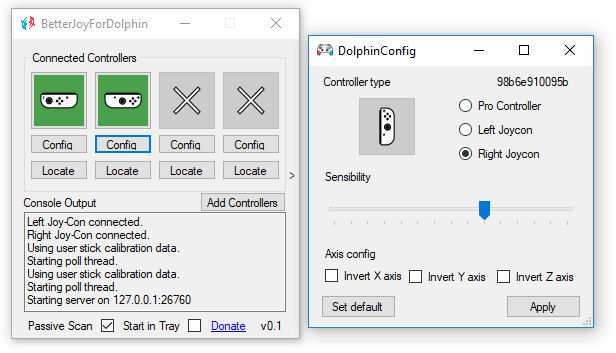

# BetterJoyForDolphin v0.1

Allows the Nintendo Switch Pro Controller and Joycons (original and 3rd party) to be used with [UDP version of Dolphin](https://mega.nz/#!Zx4TUQyZ!wc8-lbViJb4ZK1XXXrTVA6om_7Oc8s_6Ot4oX0-YYi0), the Nintendo Wii emulator.

This project is based on the amazing work done by Davidobot, creator of [BetterJoyForCemu](https://github.com/Davidobot/BetterJoyForCemu).

## Donations

If you would like to support the development of BetterJoyForDolphin, consider donating to the [BetterJoyForCemu](https://www.paypal.me/DavidKhachaturov/5) project.

And if you feel generous you can also donate directly to BetterJoyForDolphin (and to me) at the following [link](https://www.paypal.me/yuk27/3).

## Getting Started

### Required software:
* [BetterJoyForDolphin (x64)](https://drive.google.com/file/d/1khZeiImVFSEpsl-TIQdA165rACsAGSmK/view)
* [UDP version of Dolphin](https://mega.nz/#!Zx4TUQyZ!wc8-lbViJb4ZK1XXXrTVA6om_7Oc8s_6Ot4oX0-YYi0)

### Prerequisites

#### Configure Dolphin UDP

After downloading and extracting UDP Dolphin, you need to manually add the port information to WiimoteNew.ini (By default located on path ..\Documents\Dolphin Emulator\Config\WiimoteNew.ini):

### Extra code: 
```
UDP Wiimote/Port = 4434 
UDP Wiimote/Enable = 1
```

* (It's recommended to use port 4434, 4435, 4436, 4437 for controller 1, 2, 3, 4 respectively, but this can be modified to the user needs).

### Example:
```
[Wiimote1] 
Source = 0
UDP Wiimote/Port = 4434
UDP Wiimote/Enable = 1
[Wiimote2]
Source = 0
UDP Wiimote/Enable = 1
UDP Wiimote/Port = 4435
[Wiimote3]
Source = 0
UDP Wiimote/Enable = 1
UDP Wiimote/Port = 4436
[Wiimote4]
Source = 0
UDP Wiimote/Enable = 1
UDP Wiimote/Port = 4437
```

You can also download a already configured version of [WiimoteNew.ini](https://drive.google.com/file/d/1tt0Misr_7DRHsGxq4lUggrtC0-6o9Cqz/view).

For more information on Dolphin UDP please refer to the [Dolphin Forum](https://forums.dolphin-emu.org/Thread-unofficial-udpmote-for-android).

### Installing

1. Install drivers (if BetterJoyForCemu drivers have been installed before this step is not needed)
    1. Run *! Driver Install (Run as Admin).bat*
    
2. Run BetterJoyForDolphin.exe
    1. If running for the first time, things might glitch out - just close the program normally and restart your computer for the drivers to take effect.
    
3. Connect your controllers (via bluetooth or USB).

4. Once the controller has been detected by BetterJoyForDolphin, click on the Config option just under the controller icon. In there you can identify the Accelerometer sensibility, the direction of the axis and the type of controller (Needed for 3rd party Joycons, as this are by default set as Pro controllers).

5. Start Dolphin UDP and ensure WiimoteNew has been correctly modified.

6. Go to controllers option in Dolphin and configure it normally.

## Compatibilty with Cemuhook

BetterJoyForDolphin mantains legacy functionalities from BetterJoyForCemu, so you can test the controller accelerometer and gyro by using [padtest](https://files.sshnuke.net/PadTest_1011.zip).

For more information on cemuhook, please refer to the follwing [link](https://cemuhook.sshnuke.net/padudpserver.html).

### App Settings

BetterJoyForDolphin settings allow to set the port being used for each controller on Dolphin UDP , just click in the panel, set the expected port, click away from the panel and click on "Apply".



For more information on the legacy settings from BetterJoyForCemu please refer to [App Settings](https://github.com/Davidobot/BetterJoyForCemu/blob/master/README.md)

## Problems
### Make sure you installed the drivers!!

### 3rd party Joycons are recognise as Pro Controllers
As 3rd party controllers can have different internal IDs of what is expected on a 1st party controller, by default 3rd party controllers are set as Pro controllers, you can manually identify the type of controller you are using by going to "Config" option just under the controller icon, a Panel will appear where you can identifying the controller by it's type and click apply, this will store the controller information on the serials.dat file.

### Motion Controls work erratic

Try playing with the sensibility option on the Config panel, as depending on the controller sometimes sensibility can be lower or higher than expected from a Wiimote (as we are emulating one).

### 3rd party right controller works less accurate than left one 

Some 3rd party right controllers information can be different from what is expected, you can try solving the issue by inverting the Y and Z axis on the controller configuration panel and tweaking the sensibility as needed.



For more problems solutions please refer to [Problems](https://github.com/Davidobot/BetterJoyForCemu/blob/master/README.md).


# Connecting the Controller
## Bluetooth Mode
Hold down the small button on the top of the controller for 5 seconds - this puts the controller into broadcasting mode.

Search for it in your bluetooth settings and pair normally.

To disconnect the controller - press down the button once. To reconnect - press any button on your controller.

## USB Mode
Plug the controller into your computer.

## WIP and expected future additions: (Order by priority, I accept requests ;) ) 

* Bug and accuracy fixes.
* Handling of Wii IR functionalities (maybe using the Joycon gyro).
* Adding Motion controls to Nunchucks using the right Joycon accelerometer.
* Win the lottery to have the time and money to work on this kind of projects.

## Videos
* [Playing Super Mario Galaxy 2](https://youtu.be/ZCq107Qthkw)

## Acknowledgments

A massive THANK YOU out to [Davidobot](https://github.com/Davidobot) for creating BetterJoyForCemu, please keep the amazing work!

A massive THANK YOU out to [kevlahnota](https://github.com/kevlahnota) for creating Dolphin-Ishiiruka UDPWii, and keeping the option of creating over his work.

